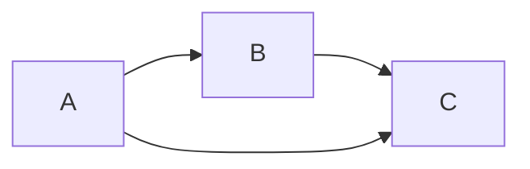

# TestStackEdit

- a test from adding from
- github
- for funziez

## Continuing from stackEdit
test

```mermaid
graph LR
A --> B
B --> C
A --> C
```

<!--stackedit_data:
eyJoaXN0b3J5IjpbMTY5Nzg1MTY1Nl19
-->